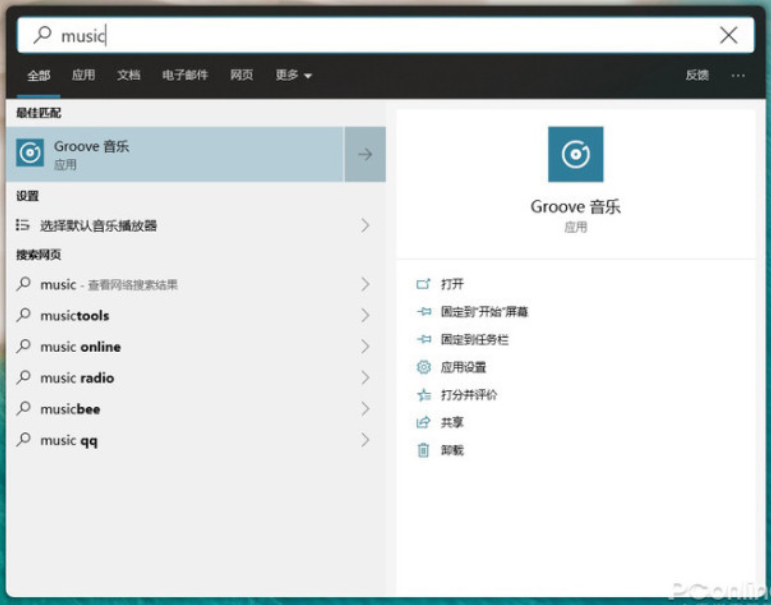

# QuickLauncher

* 正在开发中

* QuickLauncher 类似19年windows insider版本中被抛弃的Windows Search（Windows + S），由于本人喜欢这种设计故打算做一个辅助应用。

  

* 若您还停留在1809与1909之间的版本，也可通过导入以下注册表项开启测试版windows search

  ```
  Windows Registry Editor Version 5.00
  
  [HKEY_CURRENT_USER\Software\Microsoft\Windows\CurrentVersion\Search]
  "ImmersiveSearch"=dword:00000001
  [HKEY_CURRENT_USER\Software\Microsoft\Windows\CurrentVersion\Search\Flighting\Override]
  "CenterScreenRoundedCornerRadius"=dword:00000009
  ```

* 使用方法，复制上述文本，建立一个以reg后缀的文件粘贴，保存运行即可。

